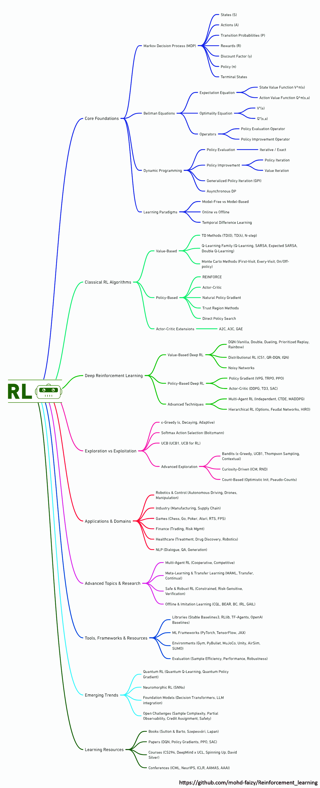

<div align="center">

# 🧠 Reinforcement Learning

*A comprehensive repository for learning Reinforcement Learning through theory, algorithms, and hands-on practice.*

[](https://github.com/mohd-faizy)
[](https://www.python.org/)
[](https://pytorch.org/)
[](https://gymnasium.farama.org/)
[](https://jupyter.org/)
[](LICENSE)

</div>

---

## 📚 Table of Contents

- [🧠 Reinforcement Learning](#-reinforcement-learning)
  - [📚 Table of Contents](#-table-of-contents)
  - [🛣️ Learning Roadmap](#️-learning-roadmap)
  - [🧬 What is Reinforcement Learning?](#-what-is-reinforcement-learning)
    - [🌟 Real-World Applications](#-real-world-applications)
    - [🛠️ Core Components](#️-core-components)
    - [🧠 RL vs Supervised Learning](#-rl-vs-supervised-learning)
  - [📍 Learning Path](#-learning-path)
    - [🟢 Beginner Level](#-beginner-level)
    - [🟡 Intermediate Level](#-intermediate-level)
    - [🔴 Advanced Level](#-advanced-level)
  - [⚙️ Installation](#️-installation)
    - [📋 Prerequisites](#-prerequisites)
    - [🚀 Quick Setup](#-quick-setup)
  - [📂 Repository Structure](#-repository-structure)
  - [🚀 Getting Started](#-getting-started)
    - [📊 Algorithm Implementations](#-algorithm-implementations)
    - [📓 Interactive Notebooks](#-interactive-notebooks)
  - [⚖️ License](#️-license)
  - [❤️ Support](#️-support)
  - [🪙 Credits \& Inspiration](#-credits--inspiration)
    - [📚 Foundational Resources](#-foundational-resources)
    - [🛠️ Open Source Libraries](#️-open-source-libraries)
    - [🎓 Educational Inspiration](#-educational-inspiration)
  - [🔗 Connect with me](#-connect-with-me)

---

## 🛣️ Learning Roadmap

<div align="center">
  
</div>

---

## 🧬 What is Reinforcement Learning?

Reinforcement Learning (RL) is a branch of machine learning where an **agent** learns to make decisions by interacting with an **environment**. Unlike supervised learning, RL doesn't rely on labeled data. Instead, the agent learns through trial and error, receiving **rewards** or **penalties** for its actions.

### 🌟 Real-World Applications

- 🤖 **Robotics**: Robot navigation, manipulation, and control
- 🎮 **Gaming**: AlphaGo, OpenAI Five, StarCraft II agents
- 🚗 **Autonomous Vehicles**: Path planning and decision making
- 💰 **Finance**: Algorithmic trading and portfolio management
- 🎯 **Recommendation Systems**: Personalized content delivery
- ⚡ **Energy**: Smart grid optimization and resource allocation

---

### 🛠️ Core Components

| Component | Description |
|-----------|-------------|
| 🤖 **Agent** | The decision-maker that learns and takes actions |
| 🌍 **Environment** | The world the agent interacts with (MDPs, Gym environments) |
| 🎁 **Reward Function** | Feedback signal that guides learning (positive/negative) |
| 🎯 **Policy** | The agent's strategy for choosing actions (deterministic/stochastic) |
| 💎 **Value Function** | Estimates expected future rewards from states/actions |
| 🔍 **Exploration vs Exploitation** | Balance between trying new actions and using known good ones |
| 🧠 **Training Algorithms** | Methods to improve the policy (Q-learning, policy gradients, etc.) |

---

### 🧠 RL vs Supervised Learning

| Aspect | Reinforcement Learning | Supervised Learning |
|--------|----------------------|-------------------|
| 📊 **Feedback Type** | Delayed rewards/penalties | Immediate labels |
| 📈 **Data Requirements** | Sequential interaction data | Static labeled datasets |
| 🎯 **Training Objective** | Maximize cumulative reward | Minimize prediction error |
| 📤 **Output** | Policies (action strategies) | Predictions/classifications |
| 🔄 **Learning Style** | Trial and error | Pattern recognition |
| ⏰ **Temporal Aspect** | Sequential decision making | Independent predictions |

---

## 📍 Learning Path

### 🟢 Beginner Level
- [x] 🎰 Multi-Armed Bandits
- [x] 🔄 Markov Decision Processes (MDPs)
- [x] ⚡ Dynamic Programming (Value & Policy Iteration)
- [x] 🎲 Monte Carlo Methods
- [x] ⏰ Temporal Difference Learning (TD)

### 🟡 Intermediate Level
- [x] 🎯 Q-Learning & SARSA
- [ ] 🎪 Expected SARSA & Double Q-Learning
- [ ] 📈 Function Approximation
- [x] 🧠 Deep Q-Networks (DQN)
- [ ] 🔧 DQN Variants (Double DQN, Dueling DQN)

### 🔴 Advanced Level
- [ ] 🎭 Policy Gradient Methods (REINFORCE)
- [ ] 🎪 Actor-Critic Methods (A2C, A3C)
- [ ] 🚀 Proximal Policy Optimization (PPO)
- [ ] 🌟 Deep Deterministic Policy Gradient (DDPG)
- [ ] 🎯 Soft Actor-Critic (SAC)
- [ ] 🤝 Multi-Agent Reinforcement Learning
- [ ] 🏗️ Hierarchical Reinforcement Learning

---

## ⚙️ Installation

### 📋 Prerequisites

- Python **3.13+**
- [Git](https://git-scm.com/) installed
- [UV](https://docs.astral.sh/uv/getting-started/installation/) package manager (recommended)
- (Optional) CUDA-compatible GPU for deep RL training

### 🚀 Quick Setup

```bash
# Clone the repository
git clone https://github.com/mohd-faizy/Reinforcement_learning.git
cd Reinforcement_learning

# Using UV (recommended)
uv venv rl_env
source rl_env/bin/activate   # macOS/Linux
.\rl_env\Scripts\activate    # Windows
uv pip install -r requirements.txt

# Or using pip
pip install -r requirements.txt

# Launch Jupyter Lab to explore notebooks
jupyter lab
```

---

## 📂 Repository Structure

```
Reinforcement_learning/
├── 📁 _img/                          # Images and visualizations
│   ├── rl-map.png                    # Learning roadmap
│   ├── frozen-lake.png               # Environment diagrams
│   └── ...
├── 📁 00_RL/                         # Basic RL implementations
│   ├── 02_frozen_lake.py             # FrozenLake environment
│   ├── 03_mountain_car.py            # MountainCar environment
│   ├── 04_taxi-parking.py            # Taxi environment
│   └── 05_cliffwalking.py            # CliffWalking environment
├── 📁 01_Q-Learning/                 # Q-Learning implementations
│   ├── 00_Q-Learning.ipynb           # Q-Learning tutorial
│   ├── 02_cartpole_Q.py              # CartPole with Q-Learning
│   └── 03_frozen_lake_Q.py           # FrozenLake with Q-Learning
├── 📁 02_DQN/                        # Deep Q-Network implementations
│   ├── 00_cartpole_DQN.py            # CartPole with DQN
│   └── 01_mountain_car_DQN.py        # MountainCar with DQN
├── 📓 00_RL_intro.ipynb              # Introduction to RL
├── 📓 01_Markov_Decision_Processes.ipynb
├── 📓 02_State_&_Action_value.ipynb
├── 📓 03_Policy_&_Value_Iteration.ipynb
├── 📓 05_Monte_Carlo_Methods.ipynb
├── 📓 06_Temporal_Difference_Learning.ipynb
├── 📓 _Q_vs_DQN.ipynb                # Comparison of Q-Learning vs DQN
├── 📄 requirements.txt               # Python dependencies
├── 📄 pyproject.toml                 # Project configuration
└── 📄 README.md                      # This file
```

## 🚀 Getting Started

### 📊 Algorithm Implementations

| Algorithm | Implementation | Environment | Status |
|-----------|----------------|-------------|--------|
| 🎰 **Multi-Armed Bandit** | `00_RL/` | Custom Bandits | ✅ |
| 🎯 **Q-Learning** | `01_Q-Learning/` | FrozenLake, CartPole | ✅ |
| 🧠 **Deep Q-Network (DQN)** | `02_DQN/` | CartPole, MountainCar | ✅ |
| 🔄 **Value Iteration** | `03_Policy_&_Value_Iteration.ipynb` | GridWorld | ✅ |
| 🎲 **Monte Carlo** | `05_Monte_Carlo_Methods.ipynb` | Blackjack | ✅ |
| ⏰ **TD Learning** | `06_Temporal_Difference_Learning.ipynb` | Various | ✅ |

### 📓 Interactive Notebooks

Start your RL journey with these comprehensive notebooks:

1. **[00_RL_intro.ipynb](00_RL_intro.ipynb)** - Fundamentals of RL
2. **[01_Markov_Decision_Processes.ipynb](01_Markov_Decision_Processes.ipynb)** - MDPs and Bellman equations
3. **[02_State_&_Action_value.ipynb](02_State_&_Action_value.ipynb)** - Value functions
4. **[03_Policy_&_Value_Iteration.ipynb](03_Policy_&_Value_Iteration.ipynb)** - Dynamic programming
5. **[05_Monte_Carlo_Methods.ipynb](05_Monte_Carlo_Methods.ipynb)** - MC learning
6. **[06_Temporal_Difference_Learning.ipynb](06_Temporal_Difference_Learning.ipynb)** - TD methods
7. **[_Q_vs_DQN.ipynb](_Q_vs_DQN.ipynb)** - Tabular vs Deep RL comparison

```bash
# Start with the introduction notebook
jupyter lab 00_RL_intro.ipynb
```

---

## ⚖️ License

This project is licensed under the MIT License - see the [LICENSE](LICENSE) file for details.


## ❤️ Support

If this repository helped you learn RL, please consider:

- ⭐ **Starring** this repository
- 🍴 **Forking** for your own experiments
- 📢 **Sharing** with fellow ML enthusiasts
- 🐛 **Contributing** improvements and bug fixes

---

## 🪙 Credits & Inspiration

This repository builds upon the incredible work of the RL community:

### 📚 Foundational Resources
- 📖 **Sutton & Barto**: *Reinforcement Learning: An Introduction* (The RL Bible)
- 🧠 **DeepMind**: Pioneering DQN, AlphaGo, and agent architectures
- 🚀 **OpenAI**: Advancing RL research and democratizing AI

### 🛠️ Open Source Libraries
- 🎮 **Gymnasium**: Standard RL environment interface
- 🔥 **PyTorch**: Deep learning framework
- 📊 **NumPy & Matplotlib**: Scientific computing and visualization
- 📓 **Jupyter**: Interactive development environment

### 🎓 Educational Inspiration
- 📺 **David Silver's RL Course** (DeepMind/UCL)
- 🎥 **Stanford CS234**: Reinforcement Learning
- 📱 **Berkeley CS 285**: Deep Reinforcement Learning

---

## 🔗 Connect with me

<div align="center">

[](https://twitter.com/F4izy)
[](https://www.linkedin.com/in/mohd-faizy/)
[](https://ai.stackexchange.com/users/36737/faizy)
[](https://github.com/mohd-faizy)

</div>

---

<div align="center">

**⭐ Star this repository if you found it helpful! ⭐**

*Happy Learning! 🚀*

</div>