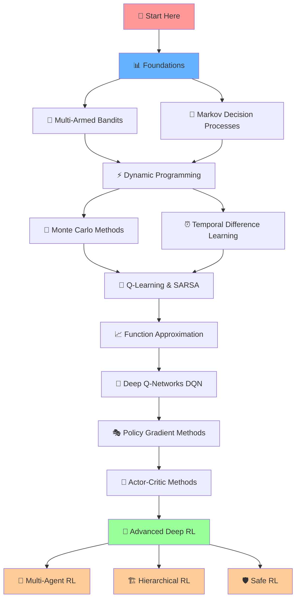

<div align="center">

# 🧠 Reinforcement Learning

*A simple repository to learn Reinforcement Learning with theory, algorithms, and practice.*

[**RL Theory**](#rl-theory) |
[**RL Algorithms**](#rl-algorithms) |
[**Implementations**](#implementations)  
[**RL Projects**](#rl-projects) |
[**RL Notebooks**](#rl-notebooks) |
[**Experiments & Results**](#experiments--results)


</div>


---

## 📚 Table of Contents

- [🧠 Reinforcement Learning](#-reinforcement-learning)
  - [📚 Table of Contents](#-table-of-contents)
  - [🛣️ Roadmap](#️-roadmap)
  - [🧬 What is Reinforcement Learning?](#-what-is-reinforcement-learning)
    - [🌟 Real-World Applications](#-real-world-applications)
    - [🛠️ Core Components](#️-core-components)
    - [🧠 RL vs Supervised Learning](#-rl-vs-supervised-learning)
  - [📍 RL Curriculum](#-rl-curriculum)
    - [🟢 Beginner Level](#-beginner-level)
    - [🟡 Intermediate Level](#-intermediate-level)
    - [🔴 Advanced Level](#-advanced-level)
  - [⚙️ Installation](#️-installation)
    - [📋 Prerequisites](#-prerequisites)
    - [🚀 Quick Setup](#-quick-setup)
    - [📦 Core Dependencies](#-core-dependencies)
  - [🚀 Examples \& Demos](#-examples--demos)
    - [📊 Algorithm Implementations](#-algorithm-implementations)
    - [🎥 Training Visualizations](#-training-visualizations)
    - [🔬 Jupyter Notebooks](#-jupyter-notebooks)
  - [🤝 Contributing](#-contributing)
    - [🛠️ How to Contribute](#️-how-to-contribute)
    - [📝 Contribution Guidelines](#-contribution-guidelines)
    - [🐛 Found a Bug?](#-found-a-bug)
  - [⚖️ License](#️-license)
  - [❤️ Support](#️-support)
  - [🪙 Credits \& Inspiration](#-credits--inspiration)
    - [📚 Foundational Resources](#-foundational-resources)
    - [🛠️ Open Source Libraries](#️-open-source-libraries)
    - [🎓 Educational Inspiration](#-educational-inspiration)
  - [🔗 Connect with me](#-connect-with-me)

---

## 🛣️ Roadmap



---

<div align="center">
  
</div>

---

## 🧬 What is Reinforcement Learning?

Reinforcement Learning (RL) is a branch of machine learning where an **agent** learns to make decisions by interacting with an **environment**. Unlike supervised learning, RL doesn't rely on labeled data. Instead, the agent learns through trial and error, receiving **rewards** or **penalties** for its actions.

### 🌟 Real-World Applications

- 🤖 **Robotics**: Robot navigation, manipulation, and control
- 🎮 **Gaming**: AlphaGo, OpenAI Five, StarCraft II agents
- 🚗 **Autonomous Vehicles**: Path planning and decision making
- 💰 **Finance**: Algorithmic trading and portfolio management
- 🎯 **Recommendation Systems**: Personalized content delivery
- ⚡ **Energy**: Smart grid optimization and resource allocation

---

### 🛠️ Core Components

| Component | Description |
|-----------|-------------|
| 🤖 **Agent** | The decision-maker that learns and takes actions |
| 🌍 **Environment** | The world the agent interacts with (MDPs, Gym environments) |
| 🎁 **Reward Function** | Feedback signal that guides learning (positive/negative) |
| 🎯 **Policy** | The agent's strategy for choosing actions (deterministic/stochastic) |
| 💎 **Value Function** | Estimates expected future rewards from states/actions |
| 🔍 **Exploration vs Exploitation** | Balance between trying new actions and using known good ones |
| 🧠 **Training Algorithms** | Methods to improve the policy (Q-learning, policy gradients, etc.) |

---

### 🧠 RL vs Supervised Learning

| Aspect | Reinforcement Learning | Supervised Learning |
|--------|----------------------|-------------------|
| 📊 **Feedback Type** | Delayed rewards/penalties | Immediate labels |
| 📈 **Data Requirements** | Sequential interaction data | Static labeled datasets |
| 🎯 **Training Objective** | Maximize cumulative reward | Minimize prediction error |
| 📤 **Output** | Policies (action strategies) | Predictions/classifications |
| 🔄 **Learning Style** | Trial and error | Pattern recognition |
| ⏰ **Temporal Aspect** | Sequential decision making | Independent predictions |

---


## 📍 RL Curriculum

### 🟢 Beginner Level
- [ ] 🎰 Multi-Armed Bandits
- [ ] 🔄 Markov Decision Processes (MDPs)
- [ ] ⚡ Dynamic Programming (Value Iteration, Policy Iteration)
- [ ] 🎲 Monte Carlo Methods
- [ ] ⏰ Temporal Difference Learning (TD(0))

### 🟡 Intermediate Level
- [ ] 🎯 Q-Learning & SARSA
- [ ] 🎪 Expected SARSA & Double Q-Learning
- [ ] 📈 Function Approximation
- [ ] 🧠 Deep Q-Networks (DQN)
- [ ] 🔧 DQN Variants (Double DQN, Dueling DQN, Prioritized Replay)

### 🔴 Advanced Level
- [ ] 🎭 Policy Gradient Methods (REINFORCE)
- [ ] 🎪 Actor-Critic Methods (A2C, A3C)
- [ ] 🚀 Proximal Policy Optimization (PPO)
- [ ] 🌟 Deep Deterministic Policy Gradient (DDPG)
- [ ] 🎯 Soft Actor-Critic (SAC)
- [ ] 🤝 Multi-Agent Reinforcement Learning (MARL)
- [ ] 🏗️ Hierarchical Reinforcement Learning
- [ ] 🛡️ Safe Reinforcement Learning

---

## ⚙️ Installation

### 📋 Prerequisites

- Python **3.9+**
- [Git](https://git-scm.com/) installed
- [UV](https://docs.astral.sh/uv/getting-started/installation/) package manager installed
- (Optional) CUDA-compatible GPU for deep RL training

---

### 🚀 Quick Setup

```bash
# Clone the repository
git clone https://github.com/mohd-faizy/Reinforcement_learning.git
cd reinforcement-learning

# Create and activate a virtual environment using UV
uv venv rl_env
source rl_env/bin/activate   # macOS/Linux
.\rl_env\Scripts\activate    # Windows

# Install dependencies
uv add -r requirements.txt

# For GPU support (optional, example: CUDA 12.1)
uv pip install torch torchvision torchaudio --index-url https://download.pytorch.org/whl/cu121
```

### 📦 Core Dependencies

```txt
gymnasium>=0.29.0
torch>=2.0.0
tensorflow>=2.13.0
numpy>=1.24.0
matplotlib>=3.7.0
seaborn>=0.12.0
jupyter>=1.0.0
wandb>=0.15.0
stable-baselines3>=2.0.0
```

---

## 🚀 Examples & Demos

### 📊 Algorithm Implementations

| Algorithm | Notebook/Script | Environment | Status |
|-----------|----------------|-------------|---------|
| 🎰 Multi-Armed Bandit | `bandits/epsilon_greedy.ipynb` | Custom Bandits | ✅ |
| 🎯 Q-Learning | `tabular/q_learning_frozen_lake.ipynb` | FrozenLake-v1 | ✅ |
| 🎪 SARSA | `tabular/sarsa_cliff_walking.ipynb` | CliffWalking-v0 | ✅ |
| 🧠 DQN | `deep_rl/dqn_cartpole.py` | CartPole-v1 | ✅ |
| 🎮 DQN Atari | `deep_rl/dqn_atari_breakout.py` | ALE/Breakout-v5 | ✅ |
| 🎭 REINFORCE | `policy_gradient/reinforce_cartpole.py` | CartPole-v1 | ✅ |
| 🎪 A2C | `actor_critic/a2c_lunar_lander.py` | LunarLander-v2 | ✅ |
| 🚀 PPO | `advanced/ppo_continuous_control.py` | BipedalWalker-v3 | 🚧 |

### 🎥 Training Visualizations

<details>
<summary>🎮 Click to see training demos</summary>

| Environment | Algorithm | Demo |
|-------------|-----------|------|
| CartPole-v1 | DQN |  |
| LunarLander-v2 | A2C |  |
| Breakout | DQN |  |

</details>

### 🔬 Jupyter Notebooks

Start exploring with our interactive notebooks:

```bash
# Launch Jupyter Lab
jupyter lab

# Navigate to notebooks/
# Start with: 01_introduction_to_rl.ipynb
```

---

## 🤝 Contributing

We welcome contributions from the RL community! Here's how you can help:

### 🛠️ How to Contribute

1. **Fork** the repository
2. **Create** a feature branch (`git checkout -b feature/AmazingAlgorithm`)
3. **Commit** your changes (`git commit -m 'Add some AmazingAlgorithm'`)
4. **Push** to the branch (`git push origin feature/AmazingAlgorithm`)
5. **Open** a Pull Request

### 📝 Contribution Guidelines

- ✅ Add tests for new algorithms
- ✅ Include docstrings and comments
- ✅ Update README if needed
- ✅ Follow PEP 8 style guidelines
- ✅ Add example usage in notebooks

### 🐛 Found a Bug?

Please [open an issue](https://github.com/mohd-faizy/reinforcement-learning/issues) with:
- Description of the problem
- Steps to reproduce
- Expected vs actual behavior
- Environment details (OS, Python version, etc.)

---

## ⚖️ License

This project is licensed under the MIT License - see the [LICENSE](LICENSE) file for details.

```
MIT License

Copyright (c) 2025 MOHD FAIZY

Permission is hereby granted, free of charge, to any person obtaining a copy
of this software and associated documentation files (the "Software"), to deal
in the Software without restriction...
```

---

## ❤️ Support

If this repository helped you learn RL, please consider:

- ⭐ **Starring** this repository
- 🍴 **Forking** for your own experiments
- 📢 **Sharing** with fellow ML enthusiasts
- 🐛 **Contributing** improvements and bug fixes


---

## 🪙 Credits & Inspiration

This repository builds upon the incredible work of the RL community:

### 📚 Foundational Resources
- 📖 **Sutton & Barto**: *Reinforcement Learning: An Introduction* (The RL Bible)
- 🧠 **DeepMind**: Pioneering DQN, AlphaGo, and agent architectures
- 🚀 **OpenAI**: GPT, PPO, and democratizing RL research

### 🛠️ Open Source Libraries
- 🏋️ **Stable Baselines3**: High-quality RL implementations
- 🎯 **Spinning Up (OpenAI)**: Educational RL resource
- 🎮 **Gymnasium**: Maintained successor to OpenAI Gym
- ⚡ **Ray RLlib**: Scalable RL library
- 🧪 **TensorFlow Agents**: TF-based RL library

### 🎓 Educational Inspiration
- 📺 **David Silver's RL Course** (DeepMind/UCL)
- 🎥 **Stanford CS234**: Reinforcement Learning
- 📱 **Berkeley CS 285**: Deep Reinforcement Learning

---

## 🔗 Connect with me  

➤ If you have questions or feedback, feel free to reach out!!!  

[][twitter]
[][linkedin]
[][Portfolio]  

[twitter]: https://twitter.com/F4izy  
[linkedin]: https://www.linkedin.com/in/mohd-faizy/  
[Portfolio]: https://ai.stackexchange.com/users/36737/faizy?tab=profile  

---

<div align="center">

  
  

</div>


---

<div align="center">
  
**⭐ Star this repo if you found it helpful! ⭐**

</div>